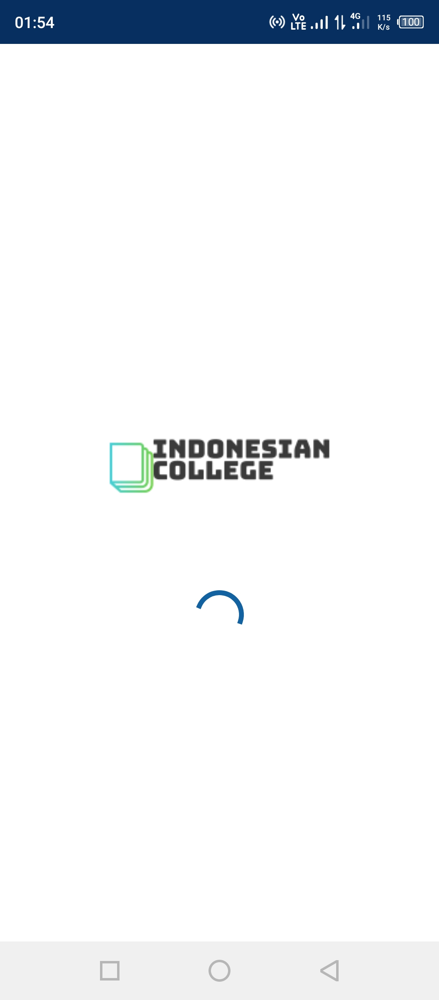
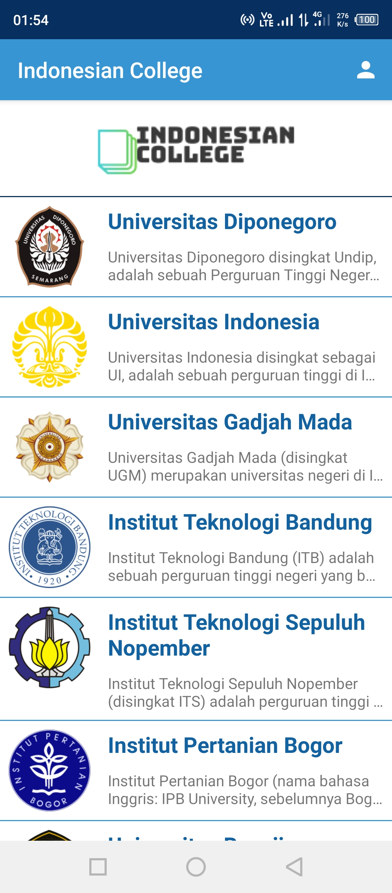
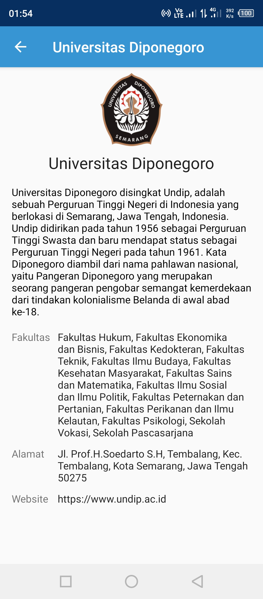
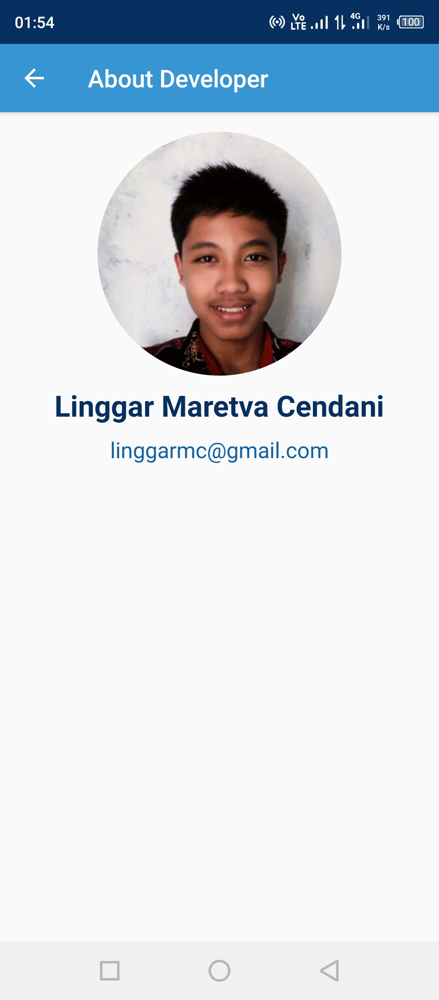

# IndonesianCollege

This is an android application that made for the final project submission for **"Belajar Membuat Aplikasi Android Untuk Pemula" (Android for Beginners)** course on Dicoding (2019). This application shows a list of **Top Universities or Colleges in Indonesia** along with their information for each of the universities.

## Screenshots
Splash Screen | Dashboard | Detail Page | About Page
:-------------------------:|:-------------------------:|:-------------------------:|:-------------------------:
  |    |    |  

## Features & Technology Used
* Java Programming Language
* Object-oriented Programming
* Fragment
* RecyclerView
* Intent
* SplashScreen

## Installation

You can install this app on your android phone by downloading the APK file in [app/release/app-release.apk](app/release/app-release.apk), copy and open it on your android phone.

## Certificate

